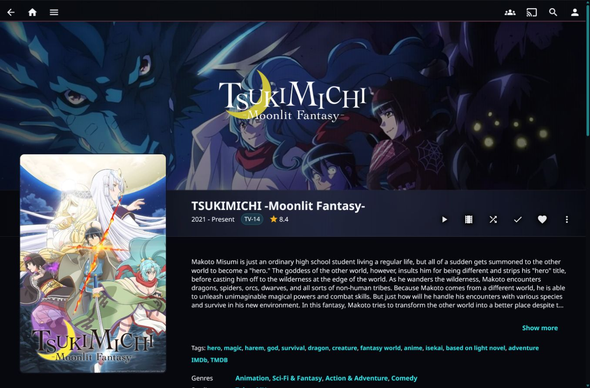
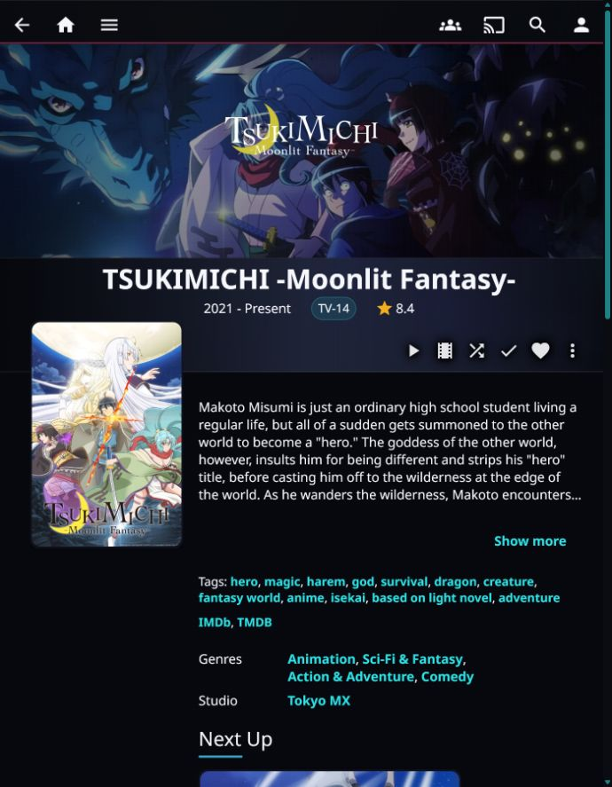
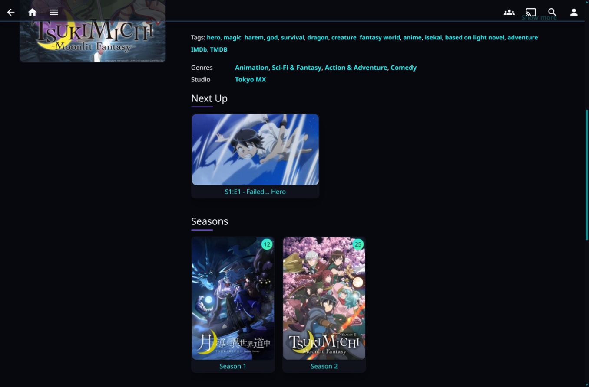
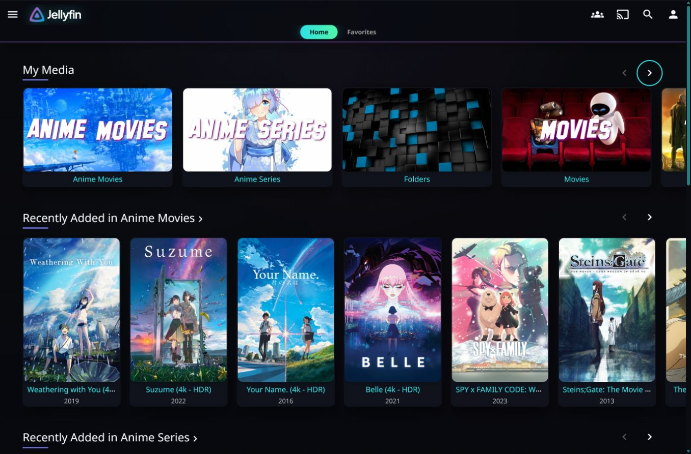
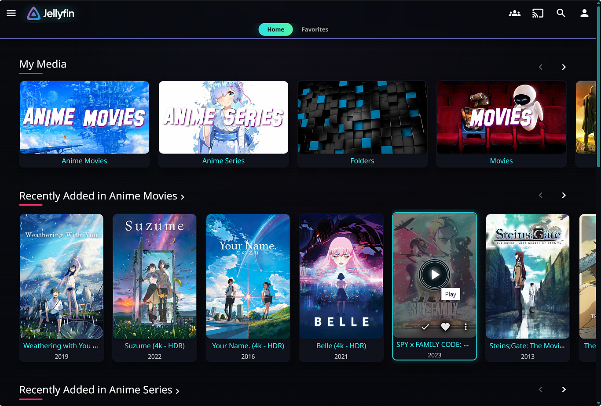

# Jellyfin Themes

Custom CSS themes for Jellyfin.

## Themes

### Aurora Stream

- Dark cinematic color palette with brighter cyan, red, purple, green, and amber accents.
- Reactive details banner and backdrop with expanded artwork space on wider screens.
- Refined detail pages with stronger poster treatment, title logo placement, and polished action rows.
- Frozen top navigation bar for easier browsing while scrolling.
- Cleaner card styling, hover states, dashboard panels, menus, dialogs, and form controls.
- Static presentation with no added CSS motion effects.

### Aurora Stream - Animated

- Includes the full Aurora Stream visual redesign.
- Animated ambience, background grain, and subtle glow/highlight movement.
- Animated section bars and navigation accents.
- Reactive card hover effects and animated focus/selection treatments.
- Animated navigation highlights and detail action button feedback.
- Subtle animated backdrop movement with large-screen perceived sharpening adjustments.

## Screenshots

### Detail Page







### Home





## Install In Jellyfin

1. Open Jellyfin as an administrator.
2. Go to `Dashboard` > `General` > `Custom CSS`.
3. Paste one of the import lines below.
4. Save, then refresh Jellyfin in your browser.

### Aurora Stream

```css
@import url("https://cdn.jsdelivr.net/gh/cloudd901/Jellyfin_Themes@main/Jellyfin_Themes/%5BCD9%5D%20Theme_Aurora%20Stream.css?v=20260703-2747e36");
```

### Aurora Stream - Animated

```css
@import url("https://cdn.jsdelivr.net/gh/cloudd901/Jellyfin_Themes@main/Jellyfin_Themes/%5BCD9%5D%20Theme_Aurora%20Stream%20-%20Animated.css?v=20260703-2747e36");
```

## Manual Install

Download one of the CSS files from `Jellyfin_Themes/`, open it in a text editor, and paste the full contents into Jellyfin's `Custom CSS` box.

## Files

- `Jellyfin_Themes/[CD9] Theme_Aurora Stream.css`: static theme.
- `Jellyfin_Themes/[CD9] Theme_Aurora Stream - Animated.css`: animated theme.

## Notes

- Aurora Stream and Aurora Stream - Animated are dark-mode themes. They apply a dark canvas and light text through custom CSS, but they do not change Jellyfin's saved display theme setting.
- These themes were made against Jellyfin Web version 10.11.11.
- These themes are designed for Jellyfin Web and clients that load Jellyfin Web from your server.
- The Windows app may not support nav bar animation, backdrop perceived sharpening, or some mouseover glass animations.
- If you already have custom CSS, paste the import line above your local overrides.
- GitHub-backed jsDelivr URLs are used for imports so the CSS is served with browser-friendly stylesheet headers. The `v=` query string is a cache buster; update it when publishing a new theme version.
